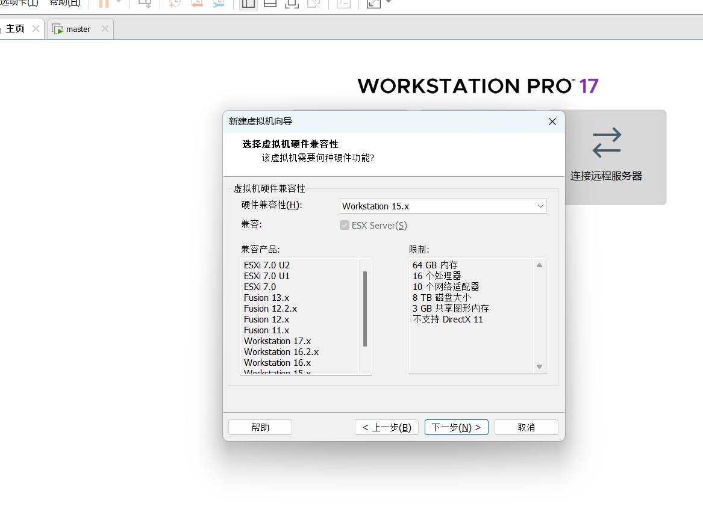
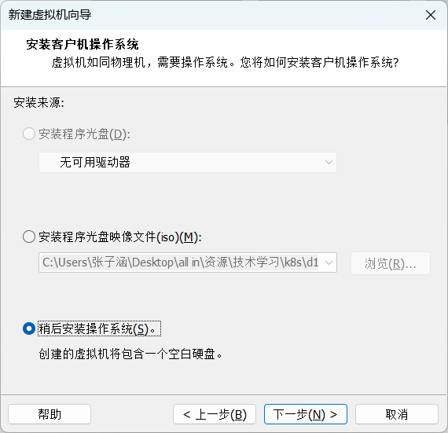
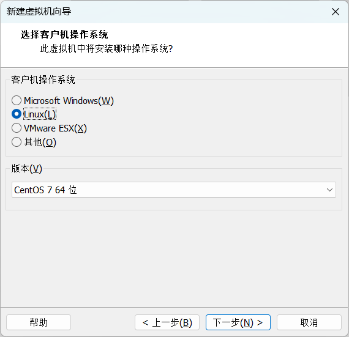
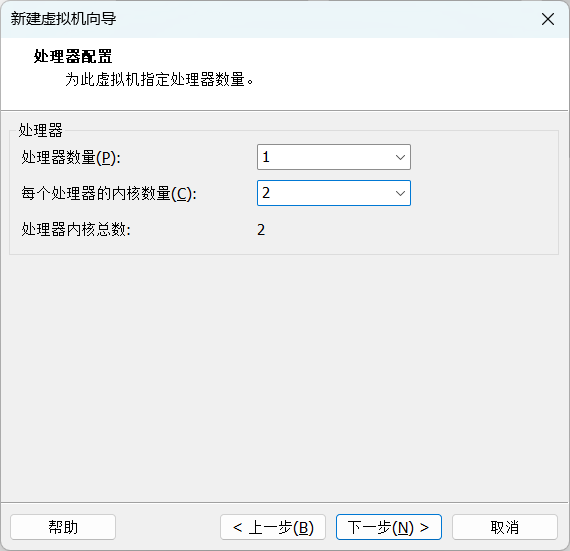
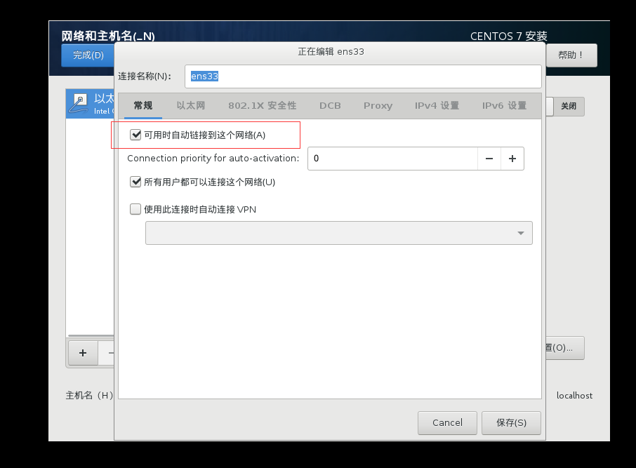
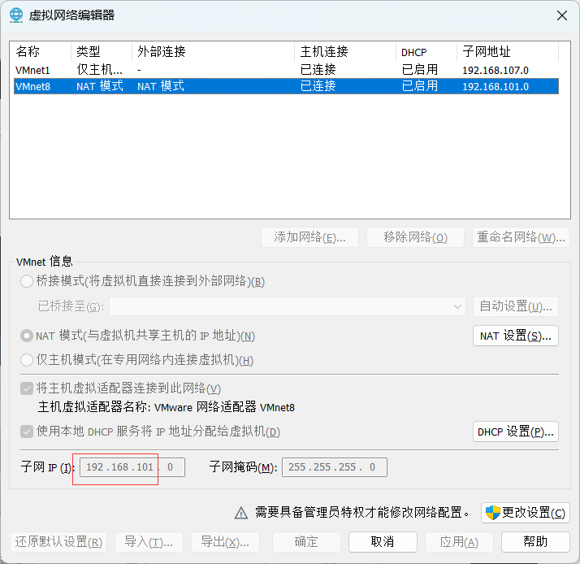
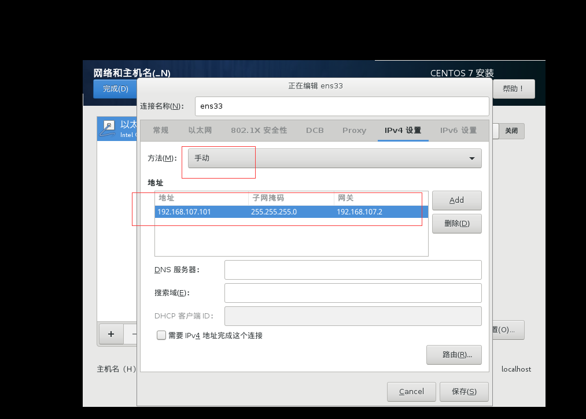
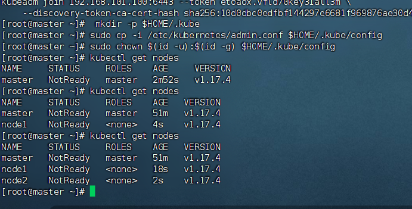
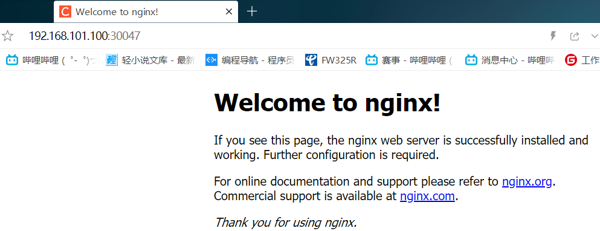

## k8s

## 安装虚拟机（master，node1，node2）









配置网络



先查看前三位，在编辑里的虚拟化网络编辑器，选择NAT模式






依次安装

master-192.168.101.100

node1-192.168.101.101

node2-192.168.101.102

## 启动finalshell连接

主机名解析

```shell
vim /etc/hosts
```

把下面三个放进三台虚拟机

```shell
# 主机名成解析 编辑三台服务器的/etc/hosts文件，添加下面内容
192.168.101.100  master
192.168.101.101  node1
192.168.101.102  node2
```

在ping一下

```shell
ping master
ping node1
ping node2
```

时间同步

kubernetes要求集群中的节点时间必须精确一致，这里直接使用chronyd服务从网络同步时间。

企业中建议配置内部的时间同步服务器

```shell
# 启动chronyd服务
[root@master ~]# systemctl start chronyd
# 设置chronyd服务开机自启
[root@master ~]# systemctl enable chronyd
# chronyd服务启动稍等几秒钟，就可以使用date命令验证时间了
[root@master ~]# date
```

给出的dns有问题，修改一下

```shell
cat /etc/resolv.conf
```

```shell
echo "nameserver 8.8.8.8" > /etc/resolv.conf
echo "nameserver 114.114.114.114" >> /etc/resolv.conf
```

然后修改配置

```shell
vim /etc/chrony.conf
```


```shel
server ntp1.aliyun.com iburst
server time.windows.com iburst
server ntp.ntsc.ac.cn iburst
server ntp.tencent.com iburst
```

这就行了

##  禁用iptables和firewalld服务

kubernetes和docker在运行中会产生大量的iptables规则，为了不让系统规则跟它们混淆，直接关闭系统的规则

```shell
# 1 关闭firewalld服务
[root@master ~]# systemctl stop firewalld
[root@master ~]# systemctl disable firewalld
# 2 关闭iptables服务
[root@master ~]# systemctl stop iptables
[root@master ~]# systemctl disable iptables
```


## 禁用selinux

selinux是linux系统下的一个安全服务，如果不关闭它，在安装集群中会产生各种各样的奇葩问题

```shell
vim /etc/selinux/config
# 编辑 /etc/selinux/config 文件，修改SELINUX的值为disabled
# 注意修改完毕之后需要重启linux服务
SELINUX=disabled
```

##  禁用swap分区

swap分区指的是虚拟内存分区，它的作用是在物理内存使用完之后，将磁盘空间虚拟成内存来使用

启用swap设备会对系统的性能产生非常负面的影响，因此kubernetes要求每个节点都要禁用swap设备

但是如果因为某些原因确实不能关闭swap分区，就需要在集群安装过程中通过明确的参数进行配置说明

```shell
# 编辑分区配置文件/etc/fstab，注释掉swap分区一行
vim /etc/fstab
# 注意修改完毕之后需要重启linux服务
 UUID=455cc753-7a60-4c17-a424-7741728c44a1 /boot    xfs     defaults        0 0
 /dev/mapper/centos-home /home                      xfs     defaults        0 0
# /dev/mapper/centos-swap swap                      swap    defaults        0 0
```

## 修改linux的内核参数

```shell
# 修改linux的内核参数，添加网桥过滤和地址转发功能
# 编辑/etc/sysctl.d/kubernetes.conf文件，添加如下配置:
vim /etc/sysctl.d/kubernetes.conf

net.bridge.bridge-nf-call-ip6tables = 1
net.bridge.bridge-nf-call-iptables = 1
net.ipv4.ip_forward = 1

# 重新加载配置
[root@master ~]# sysctl -p

# 加载网桥过滤模块
[root@master ~]# modprobe br_netfilter

# 查看网桥过滤模块是否加载成功
[root@master ~]# lsmod | grep br_netfilter
```

## 配置ipvs功能

在kubernetes中service有两种代理模型，一种是基于iptables的，一种是基于ipvs的

两者比较的话，ipvs的性能明显要高一些，但是如果要使用它，需要手动载入ipvs模块

```shell
# 1 安装ipset和ipvsadm
[root@master ~]# yum install ipset ipvsadmin -y

# 2 添加需要加载的模块写入脚本文件
[root@master ~]# cat <<EOF >  /etc/sysconfig/modules/ipvs.modules
#!/bin/bash
modprobe -- ip_vs
modprobe -- ip_vs_rr
modprobe -- ip_vs_wrr
modprobe -- ip_vs_sh
modprobe -- nf_conntrack_ipv4
EOF

# 3 为脚本文件添加执行权限
[root@master ~]# chmod +x /etc/sysconfig/modules/ipvs.modules

# 4 执行脚本文件
[root@master ~]# /bin/bash /etc/sysconfig/modules/ipvs.modules

# 5 查看对应的模块是否加载成功
[root@master ~]# lsmod | grep -e ip_vs -e nf_conntrack_ipv4
```

解决不了，Centos7停止维护了

所以换源

### 解决方案：切换为国内镜像源

1. 备份原有 `repo` 文件

```shell
mv /etc/yum.repos.d/CentOS-Base.repo /etc/yum.repos.d/CentOS-Base.repo.bak
```

2. 选择一个新的镜像源

方案 1：使用阿里云 CentOS 7 镜像

```shell
curl -o /etc/yum.repos.d/CentOS-Base.repo http://mirrors.aliyun.com/repo/Centos-7.repo
```

3. 重新生成 `yum` 缓存

```shell
yum clean all
yum makecache
```

4. 测试安装

```shell
yum install ipset ipvsadm -y
```

## 重启服务器

```
reboot
```

检查一下

```shell
[root@node2 ~]# getenforce
Disabled
[root@node2 ~]# free -m
              total        used        free      shared  buff/cache   available
Mem:           1821         109        1553           9         158        1542
Swap:             0           0           0
[root@node2 ~]# 

```

## 安装docker

````shell
# 1 切换镜像源
[root@master ~]# wget https://mirrors.aliyun.com/docker-ce/linux/centos/docker-ce.repo -O /etc/yum.repos.d/docker-ce.repo

# 2 查看当前镜像源中支持的docker版本
[root@master ~]# yum list docker-ce --showduplicates

# 3 安装特定版本的docker-ce
# 必须指定--setopt=obsoletes=0，否则yum会自动安装更高版本
[root@master ~]# yum install --setopt=obsoletes=0 docker-ce-18.06.3.ce-3.el7 -y

# 4 添加一个配置文件
# Docker在默认情况下使用的Cgroup Driver为cgroupfs，而kubernetes推荐使用systemd来代替cgroupfs
[root@master ~]# mkdir /etc/docker
[root@master ~]# cat <<EOF >  /etc/docker/daemon.json
{
  "exec-opts": ["native.cgroupdriver=systemd"],
  "registry-mirrors": ["https://kn0t2bca.mirror.aliyuncs.com"]
}
EOF

# 5 启动docker
[root@master ~]# systemctl restart docker
[root@master ~]# systemctl enable docker

# 6 检查docker状态和版本
[root@master ~]# docker version
````

## 安装k8s组件

```shell
# 由于kubernetes的镜像源在国外，速度比较慢，这里切换成国内的镜像源
# 编辑/etc/yum.repos.d/kubernetes.repo，添加下面的配置 
[kubernetes]
name=Kubernetes
baseurl=http://mirrors.aliyun.com/kubernetes/yum/repos/kubernetes-el7-x86_64
enabled=1
gpgcheck=0
repo_gpgcheck=0
gpgkey=http://mirrors.aliyun.com/kubernetes/yum/doc/yum-key.gpg
       http://mirrors.aliyun.com/kubernetes/yum/doc/rpm-package-key.gpg

# 安装kubeadm、kubelet和kubectl
[root@master ~]# yum install --setopt=obsoletes=0 kubeadm-1.17.4-0 kubelet-1.17.4-0 kubectl-1.17.4-0 -y

# 配置kubelet的cgroup
# 编辑/etc/sysconfig/kubelet，添加下面的配置
KUBELET_CGROUP_ARGS="--cgroup-driver=systemd"
KUBE_PROXY_MODE="ipvs"

# 4 设置kubelet开机自启
[root@master ~]# systemctl enable kubelet
```

## 安装镜像

```shell
# 在安装kubernetes集群之前，必须要提前准备好集群需要的镜像，所需镜像可以通过下面命令查看
[root@master ~]# kubeadm config images list

# 下载镜像
# 此镜像在kubernetes的仓库中,由于网络原因,无法连接，下面提供了一种替代方案
images=(
    kube-apiserver:v1.17.4
    kube-controller-manager:v1.17.4
    kube-scheduler:v1.17.4
    kube-proxy:v1.17.4
    pause:3.1
    etcd:3.4.3-0
    coredns:1.6.5
)

for imageName in ${images[@]} ; do
	docker pull registry.cn-hangzhou.aliyuncs.com/google_containers/$imageName
	docker tag registry.cn-hangzhou.aliyuncs.com/google_containers/$imageName 		k8s.gcr.io/$imageName
	docker rmi registry.cn-hangzhou.aliyuncs.com/google_containers/$imageName
done
```

###  集群初始化

下面开始对集群进行初始化，并将node节点加入到集群中

> 下面的操作只需要在`master`节点上执行即可
>
> ```shell
> # 创建集群
> [root@master ~]# kubeadm init \
> 	--kubernetes-version=v1.17.4 \
>     --pod-network-cidr=10.244.0.0/16 \
>     --service-cidr=10.96.0.0/12 \
>     --apiserver-advertise-address=192.168.101.100
> 
> # 创建必要文件
> [root@master ~]# mkdir -p $HOME/.kube
> [root@master ~]# sudo cp -i /etc/kubernetes/admin.conf $HOME/.kube/config
> [root@master ~]# sudo chown $(id -u):$(id -g) $HOME/.kube/config
> ```
>
> 

下面的操作只需要在`node`节点上执行即可

```shell
You should now deploy a pod network to the cluster.
Run "kubectl apply -f [podnetwork].yaml" with one of the options listed at:
  https://kubernetes.io/docs/concepts/cluster-administration/addons/

Then you can join any number of worker nodes by running the following on each as root:

kubeadm join 192.168.101.100:6443 --token etoaox.vfld70key31all3m \
    --discovery-token-ca-cert-hash sha256:10d0dbc0edfbf144297e6681f969876ae30d4df24e782954e551ee62ec3473d1 

```




###  安装网络插件

kubernetes支持多种网络插件，比如flannel、calico、canal等等，任选一种使用即可，本次选择flannel

> 下面操作依旧只在`master`节点执行即可，插件使用的是DaemonSet的控制器，它会在每个节点上都运行

先上传 [kube-flannel.yml](d1\资料\kube-flannel.yml) 到服务器

```shell
# 获取fannel的配置文件
[root@master ~]# wget https://raw.githubusercontent.com/coreos/flannel/master/Documentation/kube-flannel.yml

# 修改文件中quay.io仓库为quay-mirror.qiniu.com

# 使用配置文件启动fannel
[root@master ~]# kubectl apply -f kube-flannel.yml

# 稍等片刻，再次查看集群节点的状态
[root@master ~]# kubectl get nodes
NAME     STATUS   ROLES    AGE     VERSION
master   Ready    master   15m     v1.17.4
node1    Ready    <none>   8m53s   v1.17.4
node2    Ready    <none>   8m50s   v1.17.4
```

```shell
[root@master ~]# kubectl apply -f kube-flannel.yml
podsecuritypolicy.policy/psp.flannel.unprivileged created
clusterrole.rbac.authorization.k8s.io/flannel created
clusterrolebinding.rbac.authorization.k8s.io/flannel created
serviceaccount/flannel created
configmap/kube-flannel-cfg created
daemonset.apps/kube-flannel-ds-amd64 created
daemonset.apps/kube-flannel-ds-arm64 created
daemonset.apps/kube-flannel-ds-arm created
daemonset.apps/kube-flannel-ds-ppc64le created
daemonset.apps/kube-flannel-ds-s390x created
[root@master ~]# 
```

然后还是notready

解决办法

访问[github地址](https://raw.githubusercontent.com/coreos/flannel/master/Documentation/kube-flannel.yml)

然后右键保存为kube-flannel.yml上传到服务器，kubectl apply -f kube-flannel.yml等待一会，即可

```shell
[root@master ~]# kubectl get nodes
NAME     STATUS   ROLES    AGE   VERSION
master   Ready    master   65m   v1.17.4
node1    Ready    <none>   14m   v1.17.4
node2    Ready    <none>   14m   v1.17.4
[root@master ~]# 

```

至此，环境搭建完成。

##  服务部署

接下来在kubernetes集群中部署一个nginx程序，测试下集群是否在正常工作。

```shell
# 部署nginx
[root@master ~]# kubectl create deployment nginx --image=nginx:1.14-alpine

# 暴露端口
[root@master ~]# kubectl expose deployment nginx --port=80 --type=NodePort

# 查看服务状态
[root@master ~]# kubectl get pods,service
NAME                         READY   STATUS    RESTARTS   AGE
pod/nginx-86c57db685-fdc2k   1/1     Running   0          18m

NAME                 TYPE        CLUSTER-IP      EXTERNAL-IP   PORT(S)        AGE
service/kubernetes   ClusterIP   10.96.0.1       <none>        443/TCP        82m
service/nginx        NodePort    10.104.121.45   <none>        80:30073/TCP   17m

# 4 最后在电脑上访问下部署的nginx服务
```

```shell
效果
[root@master ~]# kubectl get pod
NAME                     READY   STATUS    RESTARTS   AGE
nginx-69b6bccdf4-srgtz   1/1     Running   0          77m
[root@master ~]# kubectl get service
NAME         TYPE        CLUSTER-IP      EXTERNAL-IP   PORT(S)        AGE
kubernetes   ClusterIP   10.96.0.1       <none>        443/TCP        168m
nginx-new    NodePort    10.99.178.140   <none>        80:30047/TCP   77m
[root@master ~]# 
访问http://192.168.101.100:30047/
```




#  第三章 资源管理

本章节主要介绍yaml语法和kubernetes的资源管理方式 资源管理介绍

在kubernetes中，所有的内容都抽象为资源，用户需要通过操作资源来管理kubernetes。

>  kubernetes的本质上就是一个集群系统，用户可以在集群中部署各种服务，所谓的部署服务，其实就是在kubernetes集群中运行一个个的容器，并将指定的程序跑在容器中。
>
>  kubernetes的最小管理单元是pod而不是容器，所以只能将容器放在`Pod`中，而kubernetes一般也不会直接管理Pod，而是通过`Pod控制器`来管理Pod的。
>
>  Pod可以提供服务之后，就要考虑如何访问Pod中服务，kubernetes提供了`Service`资源实现这个功能。
>
>  当然，如果Pod中程序的数据需要持久化，kubernetes还提供了各种`存储`系统。
>
> /assets/image-20200406225334627.png)


学习kubernetes的核心，就是学习如何对集群上的`Pod、Pod控制器、Service、存储`等各种资源进行操作

##  资源管理方式

- 命令式对象管理：直接使用命令去操作kubernetes资源

  `kubectl run nginx-pod --image=nginx:1.17.1 --port=80`

- 命令式对象配置：通过命令配置和配置文件去操作kubernetes资源

  `kubectl create/patch -f nginx-pod.yaml`

- 声明式对象配置：通过apply命令和配置文件去操作kubernetes资源

  `kubectl apply -f nginx-pod.yaml`

| 类型           | 操作对象 | 适用环境 | 优点           | 缺点                             |
| -------------- | -------- | -------- | -------------- | -------------------------------- |
| 命令式对象管理 | 对象     | 测试     | 简单           | 只能操作活动对象，无法审计、跟踪 |
| 命令式对象配置 | 文件     | 开发     | 可以审计、跟踪 | 项目大时，配置文件多，操作麻烦   |
| 声明式对象配置 | 目录     | 开发     | 支持目录操作   | 意外情况下难以调试               |

###  命令式对象管理

**kubectl命令**

 kubectl是kubernetes集群的命令行工具，通过它能够对集群本身进行管理，并能够在集群上进行容器化应用的安装部署。kubectl命令的语法如下：

```shell
kubectl [command] [type] [name] [flags]
```

**comand**：指定要对资源执行的操作，例如create、get、delete

**type**：指定资源类型，比如deployment、pod、service

**name**：指定资源的名称，名称大小写敏感

**flags**：指定额外的可选参数

```shell
# 查看所有pod
kubectl get pod 

# 查看某个pod
kubectl get pod pod_name

# 查看某个pod,以yaml格式展示结果
kubectl get pod pod_name -o yaml
```

**资源类型**

kubernetes中所有的内容都抽象为资源，可以通过下面的命令进行查看:

```shell
kubectl api-resources
```

经常使用的资源有下面这些：

| 资源分类                 | 资源名称               | 缩写            | 资源作用        |
| ------------------------ | ---------------------- | --------------- | --------------- |
| 集群级别资源             | nodes                  | no              | 集群组成部分    |
| namespaces               | ns                     | 隔离Pod         |                 |
| pod资源                  | pods                   | po              | 装载容器        |
| pod资源控制器            | replicationcontrollers | rc              | 控制pod资源     |
| replicasets              | rs                     | 控制pod资源     |                 |
| deployments              | deploy                 | 控制pod资源     |                 |
| daemonsets               | ds                     | 控制pod资源     |                 |
| jobs                     |                        | 控制pod资源     |                 |
| cronjobs                 | cj                     | 控制pod资源     |                 |
| horizontalpodautoscalers | hpa                    | 控制pod资源     |                 |
| statefulsets             | sts                    | 控制pod资源     |                 |
| 服务发现资源             | services               | svc             | 统一pod对外接口 |
| ingress                  | ing                    | 统一pod对外接口 |                 |
| 存储资源                 | volumeattachments      |                 | 存储            |
| persistentvolumes        | pv                     | 存储            |                 |
| persistentvolumeclaims   | pvc                    | 存储            |                 |
| 配置资源                 | configmaps             | cm              | 配置            |
| secrets                  |                        | 配置            |                 |

**操作**

kubernetes允许对资源进行多种操作，可以通过--help查看详细的操作命令

自己看这个吧https://gitee.com/stefanie-sun-fans/k8s/blob/master/d1/%E8%AE%B2%E4%B9%89(md%E7%89%88)/Kubernetes%E7%AC%AC1%E5%A4%A9.md#%E8%B5%84%E6%BA%90%E7%AE%A1%E7%90%86%E6%96%B9%E5%BC%8F


###  命令式对象配置

命令式对象配置就是使用命令配合配置文件一起来操作kubernetes资源。

1） 创建一个nginxpod.yaml，内容如下：

```shell
apiVersion: v1
kind: Namespace
metadata:
  name: dev

---

apiVersion: v1
kind: Pod
metadata:
  name: nginxpod
  namespace: dev
spec:
  containers:
  - name: nginx-containers
    image: nginx:1.17.1
```

2）执行create命令，创建资源：

```shell
[root@master ~]# vim nginxpod.yaml
[root@master ~]# kubectl create -f nginxpod.yaml 
namespace/dev created
pod/nginxpod created
[root@master ~]# 

```

此时发现创建了两个资源对象，分别是namespace和pod

3）执行get命令，查看资源：

```shell
[root@master ~]#  kubectl get -f nginxpod.yaml
NAME            STATUS   AGE
namespace/dev   Active   18s

NAME            READY   STATUS    RESTARTS   AGE
pod/nginxpod    1/1     Running   0          17s
```

这样就显示了两个资源对象的信息

4）执行delete命令，删除资源：

```shell
[root@master ~]# kubectl delete -f nginxpod.yaml
namespace "dev" deleted
pod "nginxpod" deleted
```

此时发现两个资源对象被删除了

###  声明式对象配置

声明式对象配置跟命令式对象配置很相似，但是它只有一个命令apply。

```shell
# 首先执行一次kubectl apply -f yaml文件，发现创建了资源
[root@master ~]# kubectl apply -f nginxpod.yaml
namespace/dev created
pod/nginxpod created
[root@master ~]# 

# 再次执行一次kubectl apply -f yaml文件，发现说资源没有变动
[root@master ~]#  kubectl apply -f nginxpod.yaml
namespace/dev unchanged
pod/nginxpod unchanged
```

```shell
总结:
    其实声明式对象配置就是使用apply描述一个资源最终的状态（在yaml中定义状态）
	使用apply操作资源：
        如果资源不存在，就创建，相当于 kubectl create
		如果资源已存在，就更新，相当于 kubectl patch
```

扩展：kubectl可以在node节点上运行吗 ?

 kubectl的运行是需要进行配置的，它的配置文件是$HOME/.kube，如果想要在node节点运行此命令，需要将master上的.kube文件复制到node节点上，即在master节点上执行下面操作：

```shell
scp  -r  HOME/.kube   node1: HOME/
```

> 使用推荐: 三种方式应该怎么用 ?

创建/更新资源 使用声明式对象配置 kubectl apply -f XXX.yaml

删除资源 使用命令式对象配置 kubectl delete -f XXX.yaml

查询资源 使用命令式对象管理 kubectl get(describe) 资源名称

让node1也具有kubectl功能

```shell
[root@master ~]# scp -r ~/.kube node1:~/
The authenticity of host 'node1 (192.168.101.101)' can't be established.
ECDSA key fingerprint is SHA256:h6Sxc0q3Y6sSwB2GQq7cnSJE4J58g96eZgXww/OfYHU.
ECDSA key fingerprint is MD5:42:6c:34:17:8a:12:75:b5:73:9c:1c:ca:dc:61:29:a0.
Are you sure you want to continue connecting (yes/no)? y
Please type 'yes' or 'no': yes
Warning: Permanently added 'node1,192.168.101.101' (ECDSA) to the list of known hosts.
root@node1's password: 
```

#  第四章 实战入门

本章节将介绍如何在kubernetes集群中部署一个nginx服务，并且能够对其进行访问。

##  Namespace

Namespace是kubernetes系统中的一种非常重要资源，它的主要作用是用来实现**多套环境的资源隔离**或者**多租户的资源隔离**。

 默认情况下，kubernetes集群中的所有的Pod都是可以相互访问的。但是在实际中，可能不想让两个Pod之间进行互相的访问，那此时就可以将两个Pod划分到不同的namespace下。kubernetes通过将集群内部的资源分配到不同的Namespace中，可以形成逻辑上的"组"，以方便不同的组的资源进行隔离使用和管理。

 可以通过kubernetes的授权机制，将不同的namespace交给不同租户进行管理，这样就实现了多租户的资源隔离。此时还能结合kubernetes的资源配额机制，限定不同租户能占用的资源，例如CPU使用量、内存使用量等等，来实现租户可用资源的管理。

/assets/image-20200407100850484.png)

kubernetes在集群启动之后，会默认创建几个namespace

```shell
[root@master ~]# kubectl get ns
NAME              STATUS   AGE
default           Active   32h
dev               Active   16m
kube-flannel      Active   31h
kube-node-lease   Active   32h
kube-public       Active   32h
kube-system       Active   32h
[root@master ~]# 
```

下面来看namespace资源的具体操作：增删查

```shell.
[root@master ~]# kubectl create ns dev
namespace/dev created
[root@master ~]# kubectl get ns dev
NAME   STATUS   AGE
dev    Active   7s
[root@master ~]# kubectl delete ns dev
namespace "dev" deleted
[root@master ~]# 

```

**配置方式**

首先准备一个yaml文件：ns-dev.yaml

apiVersion: v1
kind: Namespace是固定写法

```yaml
apiVersion: v1
kind: Namespace
metadata:
  name: dev
```

然后就可以执行对应的创建和删除命令了：

 创建：kubectl create -f ns-dev.yaml

 删除：kubectl delete -f ns-dev.yaml

##  Pod

Pod是kubernetes集群进行管理的最小单元，程序要运行必须部署在容器中，而容器必须存在于Pod中。

Pod可以认为是容器的封装，一个Pod中可以存在一个或者多个容器。

/assets/image-20200407121501907.png)

kubernetes在集群启动之后，集群中的各个组件也都是以Pod方式运行的。可以通过下面命令查看：

```shell
[root@master ~]# kubectl get pod -n kube-system
NAME                             READY   STATUS                  RESTARTS   AGE
coredns-6955765f44-5v6x4         1/1     Running                 3          33h
coredns-6955765f44-68gtg         1/1     Running                3          33h
etcd-master                      1/1     Running                 5          33h
kube-apiserver-master            1/1     Running                 5          33h
kube-controller-manager-master   1/1     Running                 5          33h
kube-flannel-ds-amd64-2kpjt      0/1     Init:ImagePullBackOff   0          30h
kube-flannel-ds-amd64-7wmwx      0/1     Init:ImagePullBackOff   0          30h
kube-flannel-ds-amd64-fpshq      0/1     Init:ImagePullBackOff   0          30h
kube-proxy-2wj4t                 1/1     Running                 4          32h
kube-proxy-hqm7h                 1/1     Running                 5          33h
kube-proxy-l4msk                 1/1     Running                 4          32h
kube-scheduler-master            1/1     Running                 5          33h
[root@master ~]# 
```

**创建并运行**

kubernetes没有提供单独运行Pod的命令，都是通过Pod控制器来实现的，用这个pod控制器实现

```shell
# 命令格式： kubectl run (pod控制器名称) [参数] 
# --image  指定Pod的镜像
# --port   指定端口
# --namespace  指定namespace
[root@master ~]# kubectl run nginx --image=nginx:1.17.1 --port=80 --namespace dev 
deployment.apps/nginx created
```

获取pod，指定namespace

```shell
 kubectl get pods -n dev
```

查看pod信息

```shell
 kubectl describe pod nginx-5ff7956ff6-fg2db -n dev
```

访问pod

```shell
[root@master ~]# kubectl get pods -n dev -o wide
NAME                     READY   STATUS    RESTARTS   AGE   IP            NODE    NOMINATED NODE   READINESS GATES
nginx-64777cd554-x9s4h   1/1     Running   0          72s   10.244.1.12   node1   <none>           <none>
[root@master ~]# curl 10.244.1.12:80
<!DOCTYPE html>
<html>
<head>
<title>Welcome to nginx!</title>
<style>
    body {
        width: 35em;
        margin: 0 auto;
        font-family: Tahoma, Verdana, Arial, sans-serif;
    }
</style>
</head>
<body>
<h1>Welcome to nginx!</h1>
<p>If you see this page, the nginx web server is successfully installed and
working. Further configuration is required.</p>

<p>For online documentation and support please refer to
<a href="http://nginx.org/">nginx.org</a>.<br/>
Commercial support is available at
<a href="http://nginx.com/">nginx.com</a>.</p>

<p><em>Thank you for using nginx.</em></p>
</body>
</html>
[root@master ~]# 

```

删除指定pod

```shell
[root@master ~]# kubectl delete pod  nginx-64777cd554-x9s4h -n dev
pod "nginx-64777cd554-x9s4h" deleted
[root@master ~]# 
```

再次查看

```shell
[root@master ~]# kubectl get pod -n dev
NAME                     READY   STATUS              RESTARTS   AGE
nginx-64777cd554-w9kkk   0/1     ContainerCreating   0          33s
```

不能完全杀死，杀死了会重启，因为pods控制器

所以要删除控制器才可以

```shell
# 接下来，删除此PodPod控制器
[root@master ~]# kubectl delete deploy nginx -n dev
deployment.apps "nginx" deleted

# 稍等片刻，再查询Pod，发现Pod被删除了
[root@master ~]# kubectl get pods -n dev
No resources found in dev namespace.
```

**配置操作**

创建一个pod-nginx.yaml，内容如下：

```shell
apiVersion: v1
kind: Pod
metadata:
  name: nginx
  namespace: dev
spec:
  containers:
  - image: nginx:1.17.1
    name: pod
    ports:
    - name: nginx-port
      containerPort: 80
      protocol: TCP
```

然后就可以执行对应的创建和删除命令了：

 创建：kubectl create -f pod-nginx.yaml

 删除：kubectl delete -f pod-nginx.yaml

##  Label

Label是kubernetes系统中的一个重要概念。它的作用就是在资源上添加标识，用来对它们进行区分和选择。

Label的特点：

- 一个Label会以key/value键值对的形式附加到各种对象上，如Node、Pod、Service等等
- 一个资源对象可以定义任意数量的Label ，同一个Label也可以被添加到任意数量的资源对象上去
- Label通常在资源对象定义时确定，当然也可以在对象创建后动态添加或者删除

可以通过Label实现资源的多维度分组，以便灵活、方便地进行资源分配、调度、配置、部署等管理工作。

> 一些常用的Label 示例如下：
>
> - 版本标签："version":"release", "version":"stable"......
> - 环境标签："environment":"dev"，"environment":"test"，"environment":"pro"
> - 架构标签："tier":"frontend"，"tier":"backend"

标签定义完毕之后，还要考虑到标签的选择，这就要使用到Label Selector，即：

 Label用于给某个资源对象定义标识

 Label Selector用于查询和筛选拥有某些标签的资源对象

当前有两种Label Selector：

- 基于等式的Label Selector

  name = slave: 选择所有包含Label中key="name"且value="slave"的对象

  env != production: 选择所有包括Label中的key="env"且value不等于"production"的对象

- 基于集合的Label Selector

  name in (master, slave): 选择所有包含Label中的key="name"且value="master"或"slave"的对象

  name not in (frontend): 选择所有包含Label中的key="name"且value不等于"frontend"的对象

标签的选择条件可以使用多个，此时将多个Label Selector进行组合，使用逗号","进行分隔即可。例如：

 name=slave，env!=production

 name not in (frontend)，env!=production

### 加标签

```shell
[root@master ~]# kubectl get pod -n dev
NAME                     READY   STATUS    RESTARTS   AGE
nginx-64777cd554-w9kkk   1/1     Running   0          30m
[root@master ~]# kubectl label pod nginx-64777cd554-w9kkk version=1.0 -n dev
pod/nginx-64777cd554-w9kkk labeled

```

### 看标签

```shell
[root@master ~]# kubectl get pod -n dev --show-labels
NAME                     READY   STATUS    RESTARTS   AGE   LABELS
nginx-64777cd554-w9kkk   1/1     Running   0          31m   pod-template-hash=64777cd554,run=nginx,version=1.0
[root@master ~]# 
```

### 筛选标签

```shell
[root@master ~]# kubectl get pod -n dev -l version=1.0  --show-labels
NAME                     READY   STATUS    RESTARTS   AGE   LABELS
nginx-64777cd554-w9kkk   1/1     Running   0          32m   pod-template-hash=64777cd554,run=nginx,version=1.0
[root@master ~]# kubectl get pod -n dev -l version!=2.0 --show-labels
No resources found in dev namespace.
```

### 删标签

```shell
[root@master ~]# kubectl label pod nginx-64777cd554-w9kkk  version- -n dev
pod/nginx-64777cd554-w9kkk labeled
```

